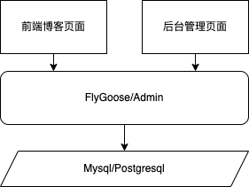

# flygoose

## 一、依赖

+ mysql 8.0+ 或 postgresql 12+（需要自己安装），并创建好数据库`db_flygoose`,字符集为`utf-8`

## 二、架构



## 三、部署文档

### 3.1 二进制包部署

1. 根据部署服务器对应的操作系统和CPU型号下载对应的二进制包，地址：

   > https://github.com/helloworld-Co/flygoose-api/releases
   > https://github.com/BLF2/flygoose-api/releases

2. 以下配置修改为自己的配置并保存为`flygoose-config.yaml`，与第1步中下载的二进制文件放在同一个文件夹下

   ```yaml
   # 服务端口
   http:
     port: 29090
   database:
     # 数据库类型 取值mysql或postgresql
     driver: mysql
     # 数据库IP
     host: 127.0.0.1
     # 数据库端口
     port: 3306
     # 数据库名称
     name: db_flygoose
     # 用户名
     user: root
     # 密码
     password: root
   ```

3. 给二进制文件赋执行权限并启动

   ```shell
   # 加执行权限
   # 请将flygoose-api-xxx-xxx替换为下载下来的文件的名称
   chomod +x flygoose-api-xxx-xxx
   # 启动
   # 请将flygoose-api-xxx-xxx替换为下载下来的文件的名称
   nohup ./flygoose-api-xxx-xxx -c ./flygoose-config.yaml &
   ```

4. 测试

   ```log
   # 服务器上curl 测试  输出 {"code":1,"data":null,"message":"success"} 即认为成功
   curl 127.0.0.1:29090/api/health
   # 本地postman 测试 输出 {"code":1,"data":null,"message":"success"} 即认为成功
   GET http://你的服务器ip:29090/api/health
   ```

### 3.2 本地打包部署

1. 环境：

   >  go 1.19+（需要自己安装），建议proxy修改为国内的地址，不然会被墙，参考[https://goproxy.cn/](https://goproxy.cn/)

2. 下载源码

3. 进入`flygoose-api/cmd/flygoose`下执行打包脚本

   ```shell
   # GOOS和GOARCH是目标服务器的操作系统和cpu架构 
   # 请选择以下合适的其中一行脚本执行
   # version请替换成正确的版本号
   GOOS=darwin GOARCH=arm64 go build -o flygoose-api-darwin-arm64-version
   GOOS=darwin GOARCH=amd64 go build -o flygoose-api-darwin-amd64-version
   GOOS=linux GOARCH=amd64 go build -o flygoose-api-linux-amd64-version
   GOOS=linux GOARCH=arm64 go build -o flygoose-api-linux-arm64-version
   GOOS=windows GOARCH=amd64 go build -o flygoose-api-windows-amd64-version
   GOOS=windows GOARCH=arm64 go build -o flygoose-api-windows-arm64-version
   ```

4. 上传打包好的二进制文件

5. 以下配置修改为自己的配置并保存为`flygoose-config.yaml`，与第4步中上传的二进制文件放在同一个文件夹下

   ```yaml
   # 服务端口
   http:
     port: 29090
   database:
     # 数据库类型 取值mysql或postgresql
     driver: mysql
     # 数据库IP
     host: 127.0.0.1
     # 数据库端口
     port: 3306
     # 数据库名称
     name: db_flygoose
     # 用户名
     user: root
     # 密码
     password: root
   ```

6. 给二进制文件赋执行权限并启动

   ```shell
   # 加执行权限
   # 请将flygoose-api-xxx-xxx替换为下载下来的文件的名称
   chomod +x flygoose-api-xxx-xxx
   # 启动
   # 请将flygoose-api-xxx-xxx替换为下载下来的文件的名称
   nohup ./flygoose-api-xxx-xxx -c ./flygoose-config.yaml &
   ```

7. 测试

   ```log
   # 服务器上curl 测试  输出 {"code":1,"data":null,"message":"success"} 即认为成功
   curl 127.0.0.1:29090/api/health
   # 本地postman 测试 输出 {"code":1,"data":null,"message":"success"} 即认为成功
   GET http://你的服务器ip:29090/api/health
   ```

### 3.3 二次开发和本地调试

1. 环境：go1.19+
2. 下载代码并使用goland打开
3. `main`和配置文件在`flygoose-api/cmd/flygoose`下